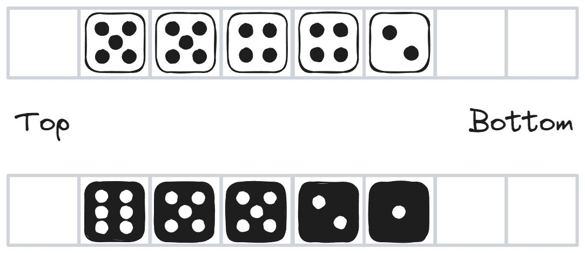
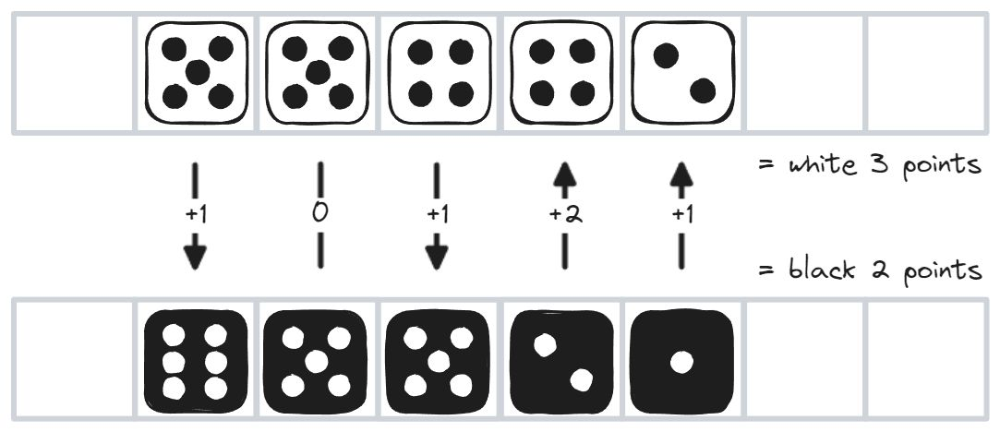

# Formation

Formation is a game of dice created by Esben Heick (2013), which is light in elements, rules and play. Its simplicity makes it suited for making into a computer game in a short time, and the frontend for this could easily be implemented in simple environments such as the console or HTML.

This document consists of two parts. The first is the rules of Formation, including the elements used to play. The second is a collection of coding ideas or challenges, of how this game could be digitally explored.

## Setup

### What you need

- The game board, which can easily be drawn quickly on a piece of graph paper. It consists of two rows of 1x8 empty grid spaces, each sized to fit a die.
- 10 6-sided dice — five in one color, five in another.
- The list of available moves.
- Markers, which can be any kind of tokens.

### Board

Each player pick a color of dice and roll all five of them. They are then sorted by their value, and placed opposite each other, with the highest die having one empty space above it, and the lowest having two empty spaces below it.

We call the direction of the higher die the _top_, and the direction of the lower die the _bottom_.

## Goal of the game

The goal of the game is to be the player with the highest point score when the game ends. It ends when all of the available moves (8 in a standard game) have been used up.

### Score

Look at all the opposite spaces with dice in them. For each of these, take the difference of the two by subtracting the lower from the higher. The difference is added to the score of the player who had the higher die. Continue with the rest of the adjacent pairs. If a space is empty on either side, it does not count.

## Turns and moves

The player with the lower score is the one who goes first. In fact, the player with the lower score is always the one to go next. One player can keep taking moves until they bring themselves in the lead, in which case the next turn shifts to the other player.

In each turn, a player makes a move, and the score is the recalculated to determine who goes next.

There are a list of available moves, each of which can only be made once in this game. This means the list is shared between the two players. Once all moves have been made, the game is over.

### The moves

- **FOUR**: turn any die to show a value of 4.
- **CHANCE**: reroll any single die.
- **ROKADE**: Move your top-most die down below your bottom-most die, or vice versa. Do not move any other dice.
- **SPLIT**: Make a split between two dice in your row, and move all of the dice in top one space up, or all the dice in the bottom one space down.
- **MOVE**: Move all dice in your row one space down.
- **BETRAY**: Switch the die in your row with the opposite die (in the opponents row).
- **PLUS TWO**: Turn a single die to show a value +2 higher than the current value.
- **DELETE**: Remove a single die.

### Experimental moves

The following moves are untested, at would naturally prolong the game, unless they replace other moves.

- **FOUR**: Turn a single die to the value 4.
- **EQUALIZER**: Choose a die, that will be dissolved.
- **MINUS**: choose a die with an opposite in the opponent's row. Both dice are reduced by the  value of the lowest of the dice - 1.

## Coding Challenge Ideas

### Frontend options

- Game implemented with a console based frontend - board is displayed as characters.
- Frontend in HTML/JS/CSS. With or without a JS framework. May or may not communicate with a backend.
- Instead of just HTML/CSS, we can draw and animate objects using `canvas` in the browser.
- Desktop graphical application (GUI), such as WPF.
- Proper game engine — for example Unity or Unreal Engine.

### Multiplayer modes

- The simplest mode is [hotseat](https://en.wikipedia.org/wiki/Hotseat_(multiplayer_mode)) play, and is easier to implement than single player, as single player will require a machine opponent.
- Direct link between two players or LAN play.
- Online matching.

### Game logic (backend)

- Game logic directly in the frontend, such as javascript in the browser, for a simple, browser only solution. This (probably) excludes the optio
- Game logic in a separate server, serving moves via a REST service, websockets, gRPC or something else.

### AI

- An AI opponent that plays randomly.
- An AI opponent that plays well enough.
- Can a perfect game be achieved?